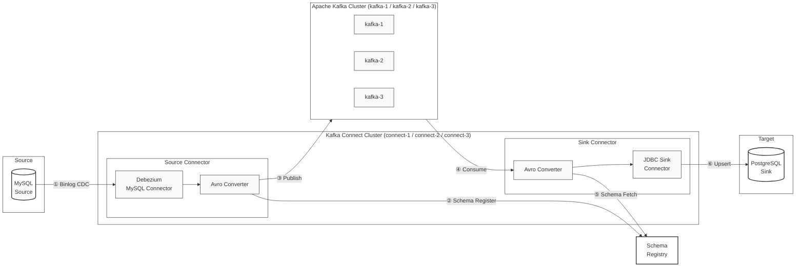

# Kafka CDC 파이프라인

MySQL의 데이터 변경사항을 Kafka를 통해 PostgreSQL로 실시간 복제하는 CDC(Change Data Capture) 파이프라인입니다.

---

## 개요

이 프로젝트는 Debezium과 Kafka Connect를 사용하여 CDC 기반의 데이터 마이그레이션 파이프라인을 구현합니다. 무중단 데이터베이스 마이그레이션이나 이기종 데이터베이스 간 실시간 동기화가 필요한 시나리오를 대상으로 설계되었습니다.

MySQL에서 발생하는 모든 변경사항(INSERT / UPDATE / DELETE)은 서비스 중단 없이 실시간으로 PostgreSQL에 전파됩니다.

---

## 아키텍처



| 단계 | 설명 |
|---|---|
| ① Binlog CDC | Debezium이 MySQL 바이너리 로그 변경사항을 실시간으로 감지 |
| ② Schema Register | Avro 스키마를 Schema Registry에 등록 |
| ③ Publish | 변경 이벤트를 Kafka 토픽에 발행 |
| ④ Consume | JDBC Sink Connector가 토픽을 구독 |
| ⑤ Schema Fetch | 역직렬화를 위해 Schema Registry에서 스키마를 조회 |
| ⑥ Upsert | PostgreSQL에 데이터를 기록 |

---

## 기술 스택

| 분류 | 기술 |
|---|---|
| 소스 DB | MySQL 8.0 |
| 타겟 DB | PostgreSQL 15 |
| 메시지 브로커 | Apache Kafka 4.1.0 (KRaft) |
| CDC 커넥터 | Debezium MySQL Connector 2.4.2 |
| Sink 커넥터 | Kafka Connect JDBC 10.7.3 |
| Schema Registry | Confluent Schema Registry 7.7.0 |
| 직렬화 | Avro |
| 모니터링 | Prometheus + Grafana |
| 인프라 | Docker Compose / AWS EC2 + RDS |

---

## 프로젝트 구조

```
kafka-cdc-pipeline/
├── Dockerfile                    # 커스텀 Kafka Connect 이미지
├── docker-compose.yml            # 로컬 환경 풀스택
├── docker-compose.prod.yml       # 프로덕션 (RDS 사용, 로컬 DB 제외)
├── .env.example                  # 환경 변수 템플릿
├── connectors/
│   ├── mysql-source.json         # Debezium Source Connector 설정
│   └── pg-sink.json              # JDBC Sink Connector 설정
├── mysql/
│   └── init.sql                  # MySQL 초기 테이블 및 계정 생성
├── monitoring/
│   └── prometheus.yml            # Prometheus 수집 설정
├── register-connectors.sh        # 커넥터 자동 등록 스크립트
└── docs/
    ├── local-setup.md            # 로컬 설정 가이드
    ├── advanced-testing.md       # 심화 테스트 가이드
    ├── aws-setup.md              # AWS 배포 가이드
    └── monitoring.md             # 모니터링 가이드
```

---

## 빠른 시작 (로컬)

### 사전 준비

- Docker Desktop 설치 및 실행
- `jq` 설치 (`brew install jq`)

### 1. 환경 변수 설정

```bash
cp .env.example .env
```

### 2. 전체 스택 실행

```bash
docker compose up -d
```

### 3. 커넥터 등록

```bash
./register-connectors.sh
```

### 4. 파이프라인 검증

```bash
# MySQL에 데이터 삽입
docker exec -it mysql-source mysql -u appuser -papppassword testdb \
  -e "INSERT INTO users (name, email) VALUES ('Alice', 'alice@example.com');"

# PostgreSQL에서 복제 확인
docker exec postgres-sink psql -U postgres targetdb \
  -c "SELECT * FROM users;"
```

### 5. 모니터링

| 서비스 | URL |
|---|---|
| Kafka UI | http://localhost:8088 |
| Grafana | http://localhost:3000 |
| Prometheus | http://localhost:9090 |

---

## 주요 기능

### 무중단 DB 마이그레이션
서비스를 중단하지 않고 MySQL에서 PostgreSQL로 데이터를 마이그레이션합니다. Debezium의 Initial Snapshot으로 기존 데이터를 먼저 복제한 뒤, 바이너리 로그를 통해 실시간으로 변경사항을 추적합니다.

### DELETE 전파
MySQL의 삭제 작업이 Debezium 툼스톤 메시지와 JDBC Sink의 `delete.enabled` 설정을 통해 PostgreSQL에도 자동으로 반영됩니다.

### 자동 스키마 진화
MySQL 테이블에 컬럼이 추가되면 PostgreSQL에서도 자동으로 `ALTER TABLE`이 실행되어 스키마가 맞춰집니다. (`auto.evolve: true`)

### 고가용성
3개의 Kafka 브로커와 3개의 Kafka Connect 인스턴스로 구성되어, 브로커 하나가 다운되더라도 파이프라인이 계속 동작합니다.

### 실시간 모니터링
Consumer LAG, 브로커 상태, 메시지 처리량을 Prometheus + Grafana를 통해 실시간으로 모니터링합니다.

---

## AWS 배포

동일한 구성을 AWS EC2 + RDS에 배포할 수 있습니다.

```
VPC (10.0.0.0/16)
├─ 퍼블릭 서브넷  → EC2 (Kafka + Connect + 모니터링)
├─ 프라이빗 서브넷 → RDS MySQL (소스)
└─ 프라이빗 서브넷 → RDS PostgreSQL (타겟)
```

자세한 내용은 [docs/aws-setup.md](docs/aws-setup.md)를 참고하세요.

---

## 문서

| 문서 | 설명 |
|---|---|
| [local-setup.md](docs/local-setup.md) | 로컬 환경 설정 및 실행 |
| [advanced-testing.md](docs/advanced-testing.md) | DELETE 전파, 스키마 진화, 멀티 테이블, 장애 복구 |
| [aws-setup.md](docs/aws-setup.md) | AWS EC2 + RDS 배포 가이드 |
| [monitoring.md](docs/monitoring.md) | Prometheus + Grafana 모니터링 설정 |

---

English documentation: [README.md](README.md)
