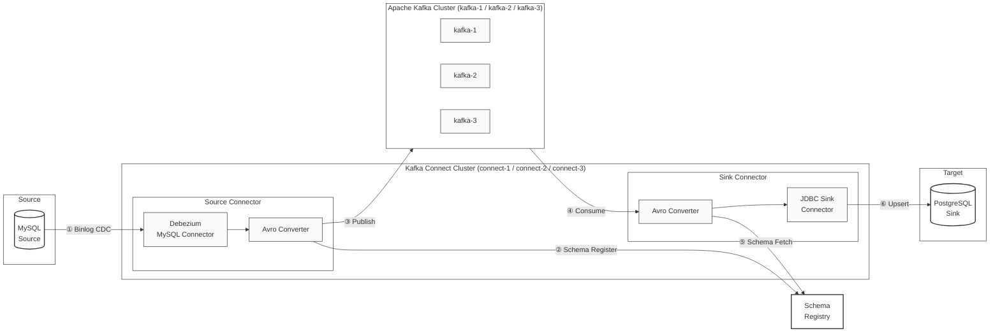

# Kafka CDC Pipeline

A real-time CDC (Change Data Capture) pipeline that replicates data changes from MySQL to PostgreSQL via Kafka.

---

## Overview

This project implements a CDC-based data migration pipeline using Debezium and Kafka Connect, designed for scenarios where you need to migrate databases with zero downtime or synchronize data between heterogeneous databases in real time.

All changes in MySQL (INSERT / UPDATE / DELETE) are captured and propagated to PostgreSQL in real time — without any service interruption.

---

## Architecture



| Step | Description |
|---|---|
| ① Binlog CDC | Debezium detects MySQL binlog changes in real time |
| ② Schema Register | Avro schema is registered in Schema Registry |
| ③ Publish | Change events are published to Kafka topics |
| ④ Consume | JDBC Sink Connector subscribes to topics |
| ⑤ Schema Fetch | Schema is fetched from Schema Registry for deserialization |
| ⑥ Upsert | Data is written to PostgreSQL |

---

## Tech Stack

| Category | Technology |
|---|---|
| Source DB | MySQL 8.0 |
| Sink DB | PostgreSQL 15 |
| Message Broker | Apache Kafka 4.1.0 (KRaft) |
| CDC Connector | Debezium MySQL Connector 2.4.2 |
| Sink Connector | Kafka Connect JDBC 10.7.3 |
| Schema Registry | Confluent Schema Registry 7.7.0 |
| Serialization | Avro |
| Monitoring | Prometheus + Grafana |
| Infra | Docker Compose / AWS EC2 + RDS |

---

## Project Structure

```
kafka-cdc-pipeline/
├── Dockerfile                    # Custom Kafka Connect image
├── docker-compose.yml            # Local environment full stack
├── docker-compose.prod.yml       # Production (uses RDS, no local DB)
├── .env.example                  # Environment variable template
├── connectors/
│   ├── mysql-source.json         # Debezium Source Connector config
│   └── pg-sink.json              # JDBC Sink Connector config
├── mysql/
│   └── init.sql                  # MySQL initial tables and accounts
├── monitoring/
│   └── prometheus.yml            # Prometheus scrape config
├── register-connectors.sh        # Connector auto-registration script
└── docs/
    ├── local-setup.md            # Local setup guide
    ├── advanced-testing.md       # Advanced testing guide
    ├── aws-setup.md              # AWS deployment guide
    └── monitoring.md             # Monitoring guide
```

---

## Quick Start (Local)

### Prerequisites

- Docker Desktop installed and running
- `jq` installed (`brew install jq`)

### 1. Set up environment variables

```bash
cp .env.example .env
```

### 2. Start the full stack

```bash
docker compose up -d
```

### 3. Register connectors

```bash
./register-connectors.sh
```

### 4. Verify the pipeline

```bash
# Insert data into MySQL
docker exec -it mysql-source mysql -u appuser -papppassword testdb \
  -e "INSERT INTO users (name, email) VALUES ('Alice', 'alice@example.com');"

# Confirm replication in PostgreSQL
docker exec postgres-sink psql -U postgres targetdb \
  -c "SELECT * FROM users;"
```

### 5. Monitoring

| Service | URL |
|---|---|
| Kafka UI | http://localhost:8088 |
| Grafana | http://localhost:3000 |
| Prometheus | http://localhost:9090 |

---

## Key Features

### Zero-Downtime DB Migration
Migrates data from MySQL to PostgreSQL without stopping the service. Debezium's Initial Snapshot replicates all existing data first, then continues tracking changes via binlog in real time.

### DELETE Propagation
Deletions in MySQL are automatically reflected in PostgreSQL using Debezium tombstone messages and the JDBC Sink's `delete.enabled` setting.

### Automatic Schema Evolution
When a column is added to a MySQL table, PostgreSQL automatically executes `ALTER TABLE` to match. (`auto.evolve: true`)

### High Availability
With a 3-broker Kafka cluster and 3-instance Kafka Connect cluster, the pipeline continues operating even if one broker goes down.

### Real-Time Monitoring
Consumer LAG, broker status, and message throughput are monitored in real time via Prometheus + Grafana.

---

## AWS Deployment

The same configuration can be deployed to AWS EC2 + RDS.

```
VPC (10.0.0.0/16)
├─ Public Subnet  → EC2 (Kafka + Connect + Monitoring)
├─ Private Subnet → RDS MySQL (Source)
└─ Private Subnet → RDS PostgreSQL (Sink)
```

See [docs/aws-setup.md](docs/aws-setup-en.md) for details.

---

## Documentation

| Document | Description |
|---|---|
| [local-setup.md](docs/local-setup-en.md) | Local environment setup and execution |
| [advanced-testing.md](docs/advanced-testing-en.md) | DELETE propagation, schema evolution, multi-table, fault tolerance |
| [aws-setup.md](docs/aws-setup-en.md) | AWS EC2 + RDS deployment guide |
| [monitoring.md](docs/monitoring-en.md) | Prometheus + Grafana monitoring setup |

---

한국어 문서는 [README-ko.md](README-ko.md)를 참고하세요.
