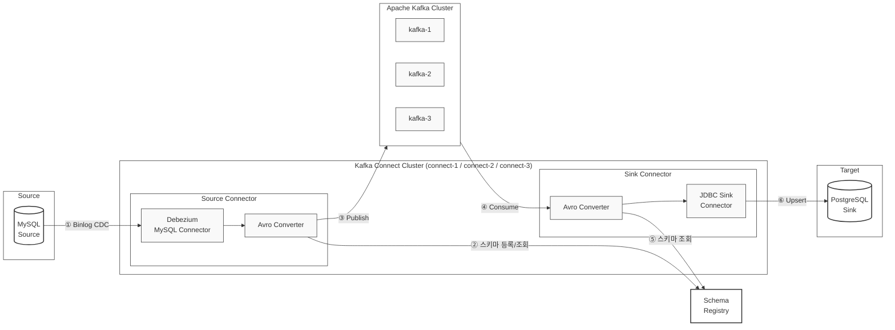

## Architecture Overview

```mermaid
flowchart LR
    classDef database fill:#ffffff,stroke:#333,stroke-width:2px;
    classDef cluster fill:#ffffff,stroke:#333,stroke-width:1px;
    classDef component fill:#f9f9f9,stroke:#333,stroke-width:1px;
    classDef registry fill:#ffffff,stroke:#333,stroke-width:2px;

    subgraph Source ["Source"]
        SourceDB[(MySQL\nSource)]:::database
    end

    subgraph KafkaConnect ["Kafka Connect Cluster  (connect-1 / connect-2 / connect-3)"]
        direction TB
        subgraph SourceSide ["Source Connector"]
            Debezium[Debezium\nMySQL Connector]:::component
            AvroIn[Avro Converter]:::component
            Debezium --> AvroIn
        end
        subgraph SinkSide ["Sink Connector"]
            AvroOut[Avro Converter]:::component
            JDBC[JDBC Sink\nConnector]:::component
            AvroOut --> JDBC
        end
    end

    SR[Schema\nRegistry]:::registry

    subgraph Kafka ["Apache Kafka Cluster"]
        direction LR
        B1[kafka-1]:::component
        B2[kafka-2]:::component
        B3[kafka-3]:::component
    end

    subgraph Target ["Target"]
        TargetDB[(PostgreSQL\nSink)]:::database
    end

    SourceDB -->|"① Binlog CDC"| Debezium
    AvroIn -->|"② 스키마 등록/조회"| SR
    AvroIn -->|"③ Publish"| Kafka
    Kafka -->|"④ Consume"| AvroOut
    AvroOut -->|"⑤ 스키마 조회"| SR
    JDBC -->|"⑥ Upsert"| TargetDB

    class KafkaConnect,Kafka cluster
```
